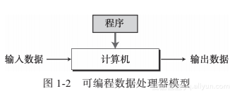
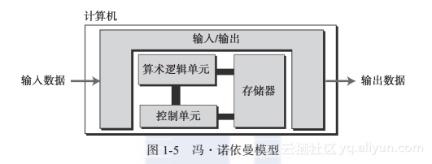

## 第01章 绪论

### 1.1 图灵模型
* 1.1.1 数据处理器

* 1.1.2 可编程数据处理器
    * 图灵模型是一个适用于通用计算机的更好模型。该模型添加了一个额外的元素 -- __程序__ 到不同的计算机器中;

    * __程序__: 使用来告诉计算机对 _数据_ 进行处理的 __指令__ 集合;
    
    * 图: 

    * 在这个图灵模型中, __输出数据__ 是依赖两方面因素的结核作用: __输入数据__ 和 __程序__

* 1.1.3 通用图灵机

### 1.2 冯·诺依曼模型
* 1.2.1 4个子系统
    * 4 个子系统: 存储器, 算术逻辑单元(ALU), 控制单元, 输入/输出单元;

    * 图: 

    * __存储器__ : 用来存储 数据和程序;

    * __算术逻辑单元(ALU)__: 用来进行计算和逻辑运算的地方;

    * __控制单元__: 对 存储器 算术逻辑单元 输入/输出 等子系统进行控制的单元;

    * __输入/输出__: 
        * 输入子系统: 负责从计算机外部接受输入数据和程序;
        * 输出子系统: 负责将计算机的处理结果输出到计算机外部.

* 1.2.2 存储程序概念
    * 冯诺依曼模型中要求 __程序必须存储在内存中__. (和早期只有数据才存储在存储器中的计算机结构完全不同);

    * 现代计算机的 __存储单元__ 用来存储 __程序__ 及其响应 __数据__;

* 1.2.3 指令的顺序执行
    * 冯诺依曼模型中的一段 __程序__ 是由一组数量有限的 __指令__ 组成;

    * __控制单元__ 从内存中提取一条指令, 解释指令, 接着执行指令 (一条条书序执行, 或者被 __控制单元__ 跳转到其他指令 前或后 执行);

### 1.3 计算机组成部分 (三大部分: 计算机硬件, 数据, 计算机软件)
* 1.3.1 计算机硬件

* 1.3.2 数据
    * 冯诺依曼模型并没有定义数据如何存储在计算机中;

    * 最好的数据存储方式应该是 _电子信号_;

* 1.3.3 计算机软件
    * 图灵或冯诺依曼模型的主要特征是 __程序__ 的概念;

    * _编程_ 在早期的计算机中体现为 __系列开关的打开或闭合以及配线的改变__;

    * 冯诺依曼模型中 __存储器__ 不仅要存储 __数据__, 还要存储 __程序__;

    * 冯诺依曼模型中要求 __程序__ 必须是 __有序的指令集__;

    * 早期只有一种成为 _机器语言_ 的计算机语言, 程序员要 _写指令(位模式)_ 来解决问题; 
        * 后来计算机科学家研究除了利用符号来表达位模式, 于是 __计算机语言__ 的概念诞生了.
    
    * __软件工程__: 是指 _结构化程序_ 的设计和编写;

    * 指令对于所有程序来说是公用的, 如果这些指令只编写一次就可以用于所有程序, 于是出现了 __操作系统__ 的概念;
        * 计算机操作系统最初是为程序访问计算机部件提供方便的一种管理程序.

### 1.4 历史
* 1.4.1 机械计算机器（1930年以前）
    * 与计算机的现代概念几乎没有相似之处;

    * 帕斯卡发明的加减运算的计算机器; 布莱尼茨发明了还能做乘除运算的计算机器; 雅卡尔发明了第一台利用存储和编程概念的提花织机;

    * 巴比奇发明了分差引擎: 与现代计算机概念类似
        * 扩展阅读: https://cn.engadget.com/2011/04/27/charles-babbages-difference-and-analytical-engines/

* 1.4.2 电子计算机的诞生(1930～1950年)
    * 1.早期的电子计算机: 并没有将 __程序__ 存储到 __存储器__ 中, 都是在计算机外部进行 __编程__ 的;
        * 图灵为了破译德国 Enigma 密码而设计的 "巨人(Colossus)" 计算机

    * 2.基于 冯诺依曼模型 的计算机: 程序也存储在存储器, 不用子从新不限或者调节成百上千的开关;
        * 第一台基于冯氏思想的计算机于 1950 年在宾夕法尼亚大学诞生

* 1.4.3 计算机的诞生（1950年至今）
    * 1. 第一代计算机: __真空管__ 作为电子开关;

    * 2. 第二代计算机: __晶体管__ 代替 真空管;

    * 3. 第三代计算机: __集成电路__ (晶体管 导线以及其他部件做在一块单芯片上) 的发明;

    * 4. 第四代计算机: 出现微型计算机,电子工业的发展允许整个计算机子系统做在单块 __电路板__ 上, 同时代还出现了 _计算机网络_;

    * 5. 第五代计算机: 掌上计算机和台式计算机, 第二代存储媒体(CD-ROM DVD 等) 的改进 多媒体的应用以及虚拟现实现象;

### 1.5 社会问题和道德问题
* 1.5.1 社会问题
* 1.5.2 道德问题

### 1.6 计算机科学作为一门学科
* 新学科: __计算机科学__

* 可归纳为两大类: _系统领域_ 和 _应用领域_
    * 系统领域: 计算机体系结构, 计算机网络, 操作系统, 算法, 程序设计语言, 软件工程 等;
    
    * 应用领域: 数据库, 人工智能 等;

### 1.7 课程纲要
* 1.7.1 第一部分：数据的表示与运算
    * 数字系统, 数据如何存储在计算机中, 位运算;

* 1.7.2 第二部分：计算机硬件
    * 硬件的通用概念, 网络的组成;

* 1.7.3 第三部分：计算机软件
    * 操作系统, 算法归纳, 程序设计语言介绍, 软件工程方法;

* 1.7.4 第四部分：数据组织与抽象
    * 数据结构, 抽象数据类型, 不同文件结构应用, 数据库;

* 1.7.5 第五部分：高级话题
    * 安全问题, 计算理论讨论, 人工智能
