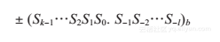
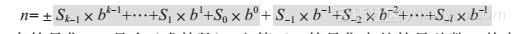
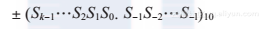
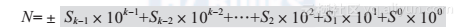
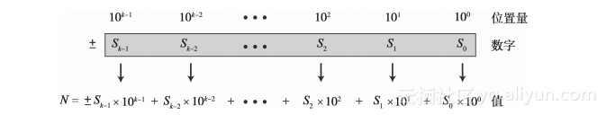
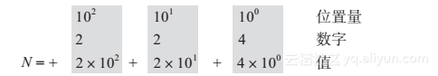
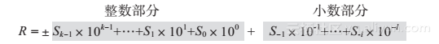
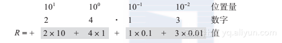

## 第02章 数字系统

### 2.1 引言
* __数字系统__ (或数码系统)

### 2.2 位置化数字系统
* 在 __位置化数字系统__ 中, 数字中符号所占据的位置决定了其表示的值.

* 数字这样表示: 

* 它的值这样表示: 
    * S 一套符号集;
    * b 是 __底__ (或 __基数__), 它等于 S 符号集中的符号总数;
    * k 表示整数部分的符号总数;
    * l 表示小数部分的符号总数.

#### 2.2.1 十进制系统（以10为底）
* __十进制系统__, 底 b = 10 且我们用 10 个符号来表示一个数;

* 符号集是 S = {0, 1, 2, 3, 4, 5, 6, 7, 8, 9};

* 该系统中的符号常被称为 __十进制数码__ 或仅称为 __数码__

* 计算机存储正负数的方式不同

* 十进制系统中，数字写为: 

* __1. 整数 (没有小数部分的整型数字)__
    * 我们把 _整数_ 表示为 ±(Sk-1 ... S1 S0)

    * 其值计算为: 
        * Sk是1个数码;
        * b = 10 是底;
        * k 是数码的数量.

    * 另一种在数字系统中显示一个整数的方法是使用 __位置量__，即用10的幂（100，101，…，10k-1）表示十进制数字

    * 

    * 例如: 在十进制系统中使用位置量表示整数+224
        * 
    
    * 最大值: Nmax = 10k - 1
        * 例如数码 k = 5, 那么用数码k表示的十进制整数的最大值 = 105 - 1 = 9999;

* __2. 实数 (带有小数部分的数字)__
    * 我们把 _实数_ 表示为 ±(Sk-1 ... S1 S0 · S-1 ... S-l)

    * 其值计算为: 
        * S1是1个数码;
        * b = 10是底;
        * k 是整数部分数码的数量; 
        * l 是小数部分数码的数量.

    * 

#### 2.2.2 二进制系统（以2为底）

#### 2.2.3 十六进制系统（以16为底）

#### 2.2.4 八进制系统（以8为底）

#### 2.2.5 4种位置化数字系统的小结

#### 2.2.6 转换

### 2.3 非位置化数字系统
